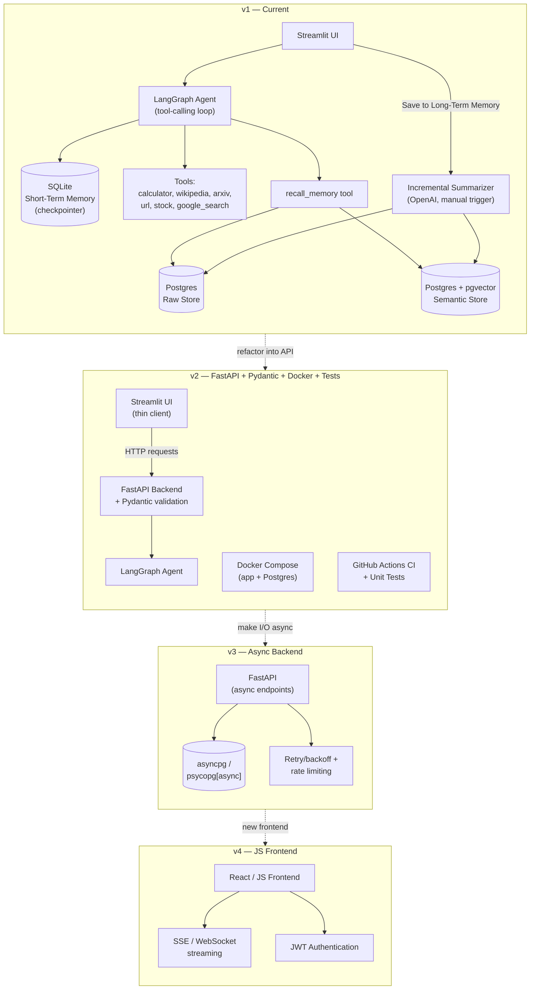

# Project Roadmap — GenAI Chatbot with Persistent Long-Term Memory

This document tracks the planned evolution of the project across versions, from the current Streamlit-based implementation through to a full-stack, async, production-style architecture.

---

## Versioning Strategy

Each stage is maintained as a separate Git branch/tag within the same repository, so the full progression remains visible and demoable — rather than scattering versions across separate repos.

```bash
git tag v1.0-streamlit
git checkout -b v2-fastapi
```

---

## v1 — Current (Streamlit + LangGraph) ✅ Done

- Short-term memory via LangGraph's SQLite checkpointer
- Long-term memory via PostgreSQL, scoped by `user_id` (not `thread_id`) for true cross-session recall
- Two long-term retrieval strategies compared side-by-side:
  - Raw (recency-based) storage
  - pgvector (semantic/embedding-based) storage
- Incremental, manually-triggered summarization (OpenAI) — only new messages since the last save are summarized
- Tool-calling agent: calculator, Wikipedia, arXiv, URL content fetch, stock prices (AlphaVantage), Google Search (Gemini-grounded)
- `recall_memory` implemented as an agent-invoked tool (not automatic) via `InjectedToolArg`
- Multi-user support — switch/add users via sidebar dropdown, with fully isolated long-term memory per user
- Session (thread) delete — removes short-term history only; long-term memory persists independently
- LangSmith tracing for token usage, cost, and latency visibility

---

## v2 — FastAPI + Pydantic + Docker + Tests ✅ Done

**Goal:** Turn the backend into a real, validated API service; Streamlit becomes a thin client.

- Introduce FastAPI as the backend service layer (`app/server.py` + `app/api/`) ✅
- Define Pydantic models for request/response validation at the API boundary (`app/schemas.py`) ✅
- Streamlit calls the API over HTTP instead of importing backend code directly (`app/frontend/client.py`) ✅
- Add `Dockerfile` + `docker-compose.yml` (multi-stage uv build, app + PostgreSQL + pgvector) ✅
- Add a unit test suite (tools, memory stores, API routes) using `BaseMemoryStore` interface seam (`tests/`) ✅
- Add GitHub Actions CI to run linter (ruff) and tests (pytest) on push/PR (`.github/workflows/ci.yml`) ✅

---

## v3 — Async Backend

**Goal:** Make I/O-bound operations (LLM calls, DB queries, embeddings) run concurrently.

- Convert FastAPI endpoints to `async def`
- Swap `psycopg2` → `asyncpg` or `psycopg[async]`
- Use LangGraph's async invocation/streaming APIs
- Add retry/backoff logic around external API calls (OpenAI, Gemini, AlphaVantage)
- Add basic rate limiting for public deployment safety
- Streamlit frontend remains synchronous — it becomes a simple client calling the now-async API, rather than being rewritten itself

---

## v4 — JavaScript Frontend

**Goal:** Replace the Streamlit prototype UI with a production-style frontend.

- Lightweight React (or plain JS) frontend consuming the FastAPI backend directly
- Real token streaming via SSE or WebSockets
- Introduce real authentication (e.g., JWT-based), replacing the current placeholder `user_id` dropdown

---

## v5 — Evaluation & Memory Quality (optional, advanced)

**Goal:** Move from "it works" to "here's how well it works, measured."

- Build a small evaluation set (sample queries + expected relevant memories) to quantitatively score raw vs. vector retrieval quality (precision/recall), extending the existing `comparator.py`
- Memory deduplication — prevent redundant summaries from accumulating in Postgres over repeated saves
- Memory decay/forgetting — down-weight or expire old long-term memories over time
- Cost-tracking dashboard — log token usage/cost per request into Postgres, surfaced in the UI or README

---

## Architecture: Current (v1) + Upcoming (v2–v4)



---

## Prioritization Notes

Ranked by resume/portfolio impact relative to effort:

1. **Finish deployment of v1** (Streamlit Cloud / HF Spaces) — highest visibility for lowest remaining effort
2. **v2 — FastAPI + Pydantic** — natural architectural story, moderate effort
3. **Tests + Docker** (part of v2) — cheap, strong professional signal
4. **v3 — Async backend** — real but substantial work
5. **v4 — JS frontend** — largest scope increase; worth it mainly if this becomes a flagship, longer-term project

**Recommended approach:** treat each version as its own milestone, reassess scope after completing v2, rather than committing to the full v1→v5 roadmap upfront.
